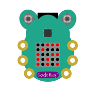
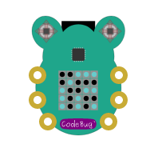

*******************
Updating CodeBug OS
*******************

Occasionally, we may release an update to the core system for CodeBug Connect.
While the update process is robust, it's possible that without care you can corrupt the system files that make recovery slightly more difficult. 

.. danger:: We strongly recommend you read and make sure you understand all these instructions before perfoming an update.

The update process is done over the Internet so you must have setup a WiFi connection that provides Internet access to your CodeBug Connect. 

.. warning:: You must store a WiFi SSID and password before attempting to update. Once you set CodeBug Connect into update mode, you cannot easily setup the WiFi.

==============
Update Process
==============

Make sure you have stored your WiFi access point and password in your Codebug Connect.  Before attempting to upgrade you should double check CodeBug can successfully connect to your WiFi.

.. caution:: Always backup your files before updating CodeBug Connect.

To update CodeBug, follow these steps:

#. From a terminal (either over USB serial or via the onboard IDE) enter the following

.. code-block:: python

   import remote_manage
   remote_manage.reboot_into_update()

#. read and follow the instructions displayed. Enter ``yes`` if appropriate.

#. When prompted, remove the power.

#. Wait for 2 seconds and then reconnect power.

#. CodeBug Connect will flash a light yellow searching for WiFi. Note the symbol is backwards compared with CodeBug Connect's normal searching for WiFi symbol.

   .. image:: img/UpdateScan1.png
      :alt: Scanning for WiFi1

   .. image:: img/UpdateScan2.png
      :alt: Scanning for WiFi2

   .. image:: img/UpdateScan3.png
      :alt: Scanning for WiFi3

#. Once network has been found CodeBug Connect will indicate successful WiFi connection.

   .. image:: img/WiFiConnectSuccess.png
      :alt: WiFi connected

#. CodeBug Connect will attempt to connect to the update server and indicate if successful.

#. Beginning from the top left, the LED display will fill with yellow dots to indicate download process. This sometimes has a slow start so be patient.

#. CodeBug Connect will process the new system files, and if successful, display a green smile for a few seconds before restarting.

Troubleshooting
^^^^^^^^^^^^^^^

If the update process fails, the LEDs show the failure reason. If no data was downloaded then on next reboot CodeBug Connect will return to run mode with the old system files. However, once a download commences the system files will have been over-written and CodeBug Connect will not boot until a successful update is achieved.

.. note:: In update mode, USB Drive and the on-board IDE modes are not available.

* WiFi connection failed (e.g. password error)

* Could not find any suitable WiFi to connect to

